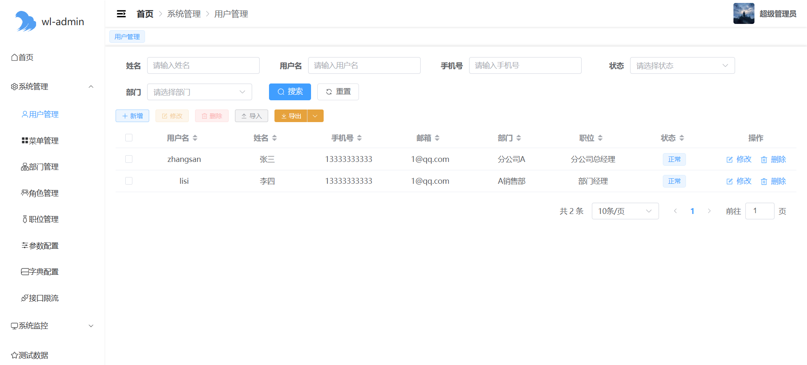
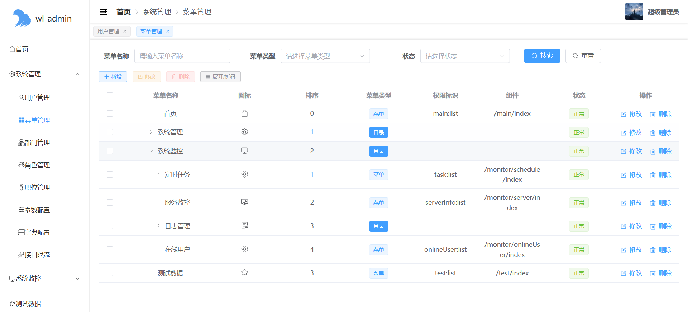
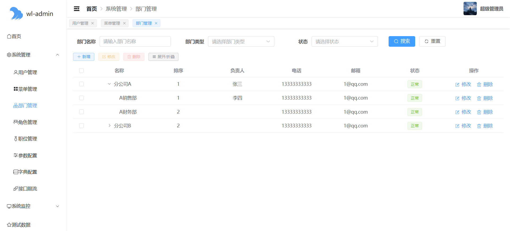
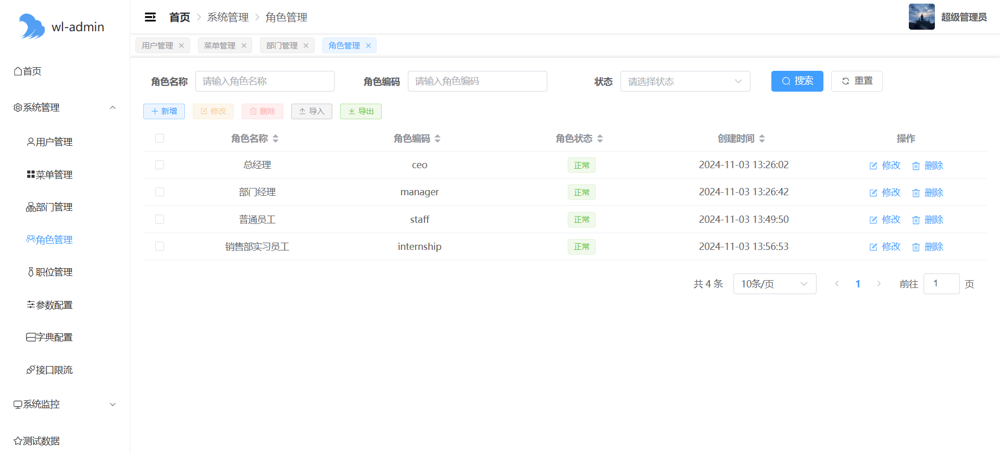
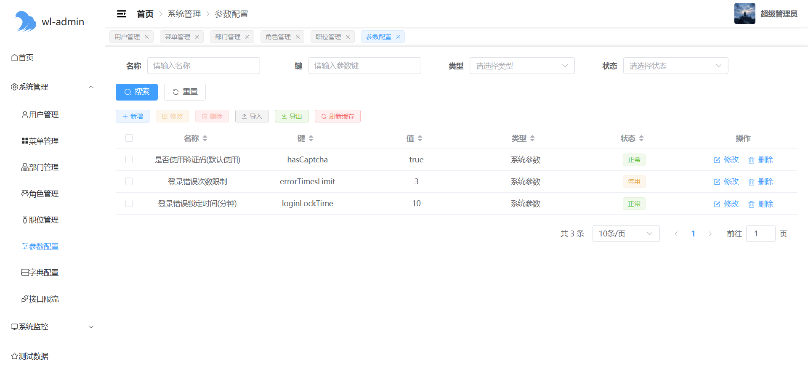
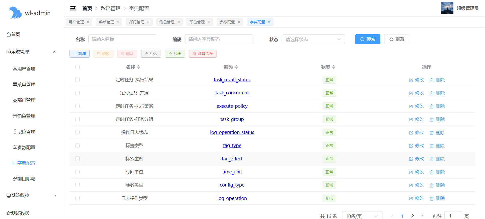
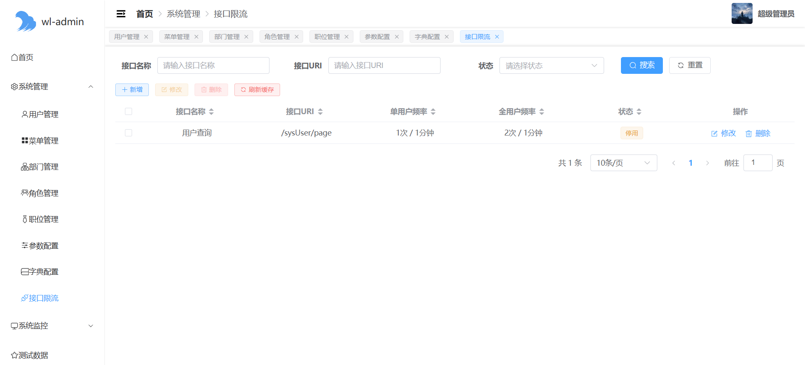
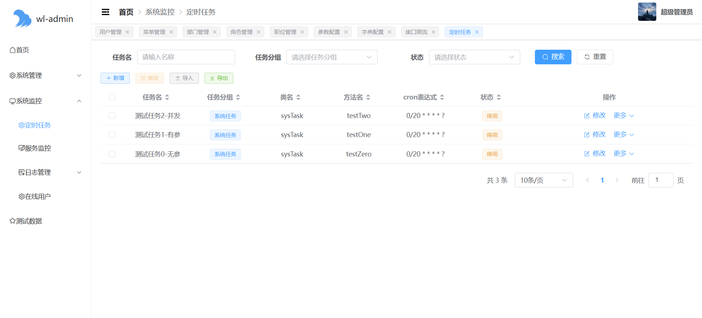
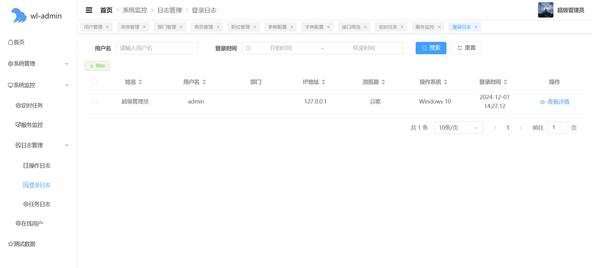
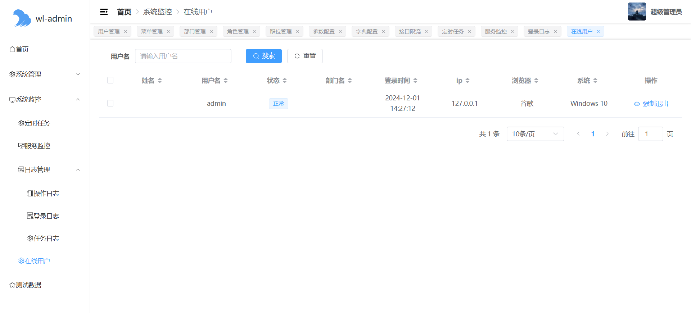

	

<h1 align="center" style="margin: 10px 0 30px; font-weight: bold;">wl-admin</h1>
<h4 align="center">基于SpringBoot3、Vue3开发的轻量级后台管理框架</h4>

	<!---->
	
	

## 项目介绍

`wl-admin`是基于`JDK21`、`Springboot3`、`Vue3`开发的轻量后台管理系统，代码简洁易于维护，适用于大多数场景‌。

* 前端代码：[Gitee](https://gitee.com/gltqe/wl-admin-ui) | [Github](https://github.com/gltqe/wl-admin-ui)
* 管理员：admin/123

## 在线文档
[wl-admin](https://gltqe.github.io/wl-admin-doc/)

## 演示地址
[还没部署]()

## 软件架构
* 运行环境：JDK21、Nodejs18.20.0、Maven3.9.8
* 后端框架：SpringBoot3.x、SpringSecurity3.x、MybatisPlus3.5.x、DynamicDatasource3.x、Quartz3.x
* 前端框架：Vue3.x、ElementPlus2.x、Axios1.7.x、echarts5.x
* 数据库：Mysql8.x、redis5.x
* web服务器：Nginx1.x

## 功能模块

### 系统管理

* 用户管理：系统用户基本信息的增删改查，修改密码等
* 菜单管理：控制左侧菜单栏和按钮的增删改查，可无限嵌套
* 部门管理：机构或部门的组织结构
* 角色管理：功能权限与数据权限，都通过角色与用户关联
* 职位管理：用户职位
* 参数配置：配置系统参数，例如：是否启用验证码
* 字典配置：维护固定参数值
* 接口限制：用于配置接口访问次数，针对每个接口分为单用户和全部用户限制，基于`redis`+`lua`

### 系统监控

* 定时任务：基于`Quartz`的定时任务模块
* 服务监控：监控内存，CPU，服务器信息
* 操作日志：通过自定义日志注解，记录操作
* 登录日志：记录登录用户信息
* 在线用户：查看当前在线用户

## 页面展示

## 交流反馈

